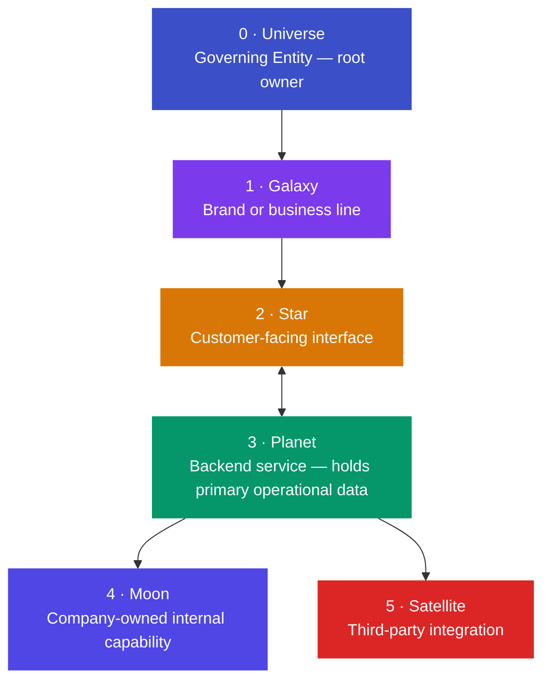

# LEBOSS

**Local Entrepreneur Business Operating System Standards**

> An open governance standard for defining clear system ownership boundaries, integration contracts, and auditable data access — for local business software systems.

See [STATUS.md](STATUS.md) for current specification status and release information.

---

## The Problem

Local businesses run on software. CRM, scheduling, billing, marketing, point-of-sale. Each system holds a piece of the business's operational data. In most cases, the **platform controls the data** — not the business.

- Switching vendors means losing history
- Integrations acquire access without declared scope
- No audit trail the business can inspect
- Portability is a feature, not a right

LEBOSS treats this as a **structural problem** with a structural solution: define ownership architecturally, not contractually.

---

## What LEBOSS Does

LEBOSS defines:

- **A reference model** — six hierarchical elements that describe who owns what in a local business software system
- **Governance objects** — the primitives (Access Grants, Audit Records, Integration Descriptors, Resources) that make data ownership enforceable
- **Operational protocols** — normative rules for how those objects behave across their lifecycle
- **A conformance definition** — the minimum requirements for claiming LEBOSS compatibility

The **Governing Entity** (Universe) owns all data. Every other element operates under explicit, scoped, revocable authorization. All governed operations produce Audit Records. The complete environment is always exportable by the Governing Entity.

---

## Five Foundation Principles

| # | Principle | Meaning |
|---|-----------|---------|
| 1 | **Clarity** | Every element has a defined role and ownership boundary |
| 2 | **Modularity** | Capabilities are interchangeable — replacing one does not cascade |
| 3 | **Security** | Entity-separated data, least-privilege access, auditable operations |
| 4 | **Legacy & Continuity** | Systems survive ownership transitions and vendor changes |
| 5 | **Extensibility** | New capabilities attach without disrupting existing structure |

---

## Specification

| Document | Content |
|----------|---------|
| [standards/leboss-standard.md](standards/leboss-standard.md) | Base standard — reference model, data ownership doctrine, service provider obligations, conformance |
| [standards/conformance.md](standards/conformance.md) | Conformance definition — minimum requirements for LEBOSS-compliant implementations |
| [standards/leboss-normative-rules.md](standards/leboss-normative-rules.md) | Flat rule register — 40 normative rules across 6 protocol groups |
| [standards/leboss-resource-model.md](standards/leboss-resource-model.md) | Resource Model |
| [standards/leboss-access-grant-protocol.md](standards/leboss-access-grant-protocol.md) | Access Grant Protocol |
| [standards/leboss-integration-protocol.md](standards/leboss-integration-protocol.md) | Integration Descriptor Protocol |
| [standards/leboss-audit-protocol.md](standards/leboss-audit-protocol.md) | Audit Record Collection Protocol |
| [standards/leboss-data-portability-protocol.md](standards/leboss-data-portability-protocol.md) | Data Portability Protocol |
| [standards/objects/access-grant.md](standards/objects/access-grant.md) | Access Grant object definition |
| [standards/objects/integration-descriptor.md](standards/objects/integration-descriptor.md) | Integration Descriptor object definition |
| [standards/objects/audit-record.md](standards/objects/audit-record.md) | Audit Record object definition |

---

## Repository Structure

| Directory | Purpose |
|-----------|---------|
| [`standards/`](standards/) | Normative specification — all MUST/SHOULD/MAY requirements |
| [`glossary/`](glossary/) | Canonical terminology definitions |
| [`governance/`](governance/) | Governance model — proposal lifecycle, committee roles |
| [`proposals/`](proposals/) | Specification change history (0.0.1 → 0.0.11) |
| [`presentations/`](presentations/) | Three-deck Slidev presentation portal |
| [`charter/`](charter/) | Mission and philosophical foundation |

---

## Quick Links

| | |
|--|--|
| **Specification** | [standards/leboss-standard.md](standards/leboss-standard.md) |
| **Conformance** | [standards/conformance.md](standards/conformance.md) |
| **Glossary** | [glossary/terms.md](glossary/terms.md) |
| **Governance** | [governance/governance.md](governance/governance.md) |
| **Proposals** | [proposals/](proposals/) |
| **Status** | [STATUS.md](STATUS.md) |
| **Presentations** | [leboss.status26.com](https://leboss.status26.com/) |
| **Implementations** | [IMPLEMENTATIONS.md](IMPLEMENTATIONS.md) |

---

## Presentations

The specification is published as a three-deck interactive presentation portal at **[leboss.status26.com](https://leboss.status26.com/)**.

| Deck | Audience | URL |
|------|----------|-----|
| Overview | Business owners, evaluators | [leboss.status26.com](https://leboss.status26.com/) |
| Architecture | Developers, architects | [leboss.status26.com/architecture/](https://leboss.status26.com/architecture/) |
| Governance | Contributors, implementers | [leboss.status26.com/governance/](https://leboss.status26.com/governance/) |

---

## Ecosystem

See [IMPLEMENTATIONS.md](IMPLEMENTATIONS.md) for projects implementing the LEBOSS standard.

---

## Contributing

LEBOSS is an open standard. Contributions are welcome from developers, architects, business owners, and anyone with a stake in local business data sovereignty.

**Specification changes** require a proposal in [`proposals/`](proposals/).
**Editorial improvements** to documentation may be submitted directly as a pull request.

See [CONTRIBUTING.md](CONTRIBUTING.md) for the full process — how to open a proposal, the lifecycle from Proposal → Draft → Committee Vote → Published, and how to nominate yourself for the committee.

Every pull request automatically generates a **Netlify preview** of the presentation system so reviewers can see changes live before merging.

---

## Current Status

The specification is at the **pre-v0.1.0 draft** milestone — the first implementable draft. The architecture, governance objects, and operational protocols are draft-stable.

| Proposal | Content |
|----------|---------|
| [0.0.1](proposals/0.0.1/proposal.md) | Initial doctrine and reference architecture |
| [0.0.2](proposals/0.0.2/proposal.md) | Normative rule register and formalization pass |
| [0.0.3](proposals/0.0.3/proposal.md) | Governance object model |
| [0.0.4](proposals/0.0.4/proposal.md) | Access Grant Protocol |
| [0.0.5](proposals/0.0.5/proposal.md) | Integration Descriptor Protocol |
| [0.0.6](proposals/0.0.6/proposal.md) | Audit Record Collection Protocol |
| [0.0.7](proposals/0.0.7/proposal.md) | Data Portability Protocol |
| [0.0.8](proposals/0.0.8/proposal.md) | Resource Model |
| [0.0.9](proposals/0.0.9/proposal.md) | Specification stabilization |
| [0.0.10](proposals/0.0.10/proposal.md) | Repository normalization |
| [0.0.11](proposals/0.0.11/proposal.md) | Canonical presentation system |

The next milestone is **v0.1.0** — the first Committee Vote candidate.

---

*LEBOSS is an open standard. All content in this repository is available for adoption, implementation, critique, and contribution.*
