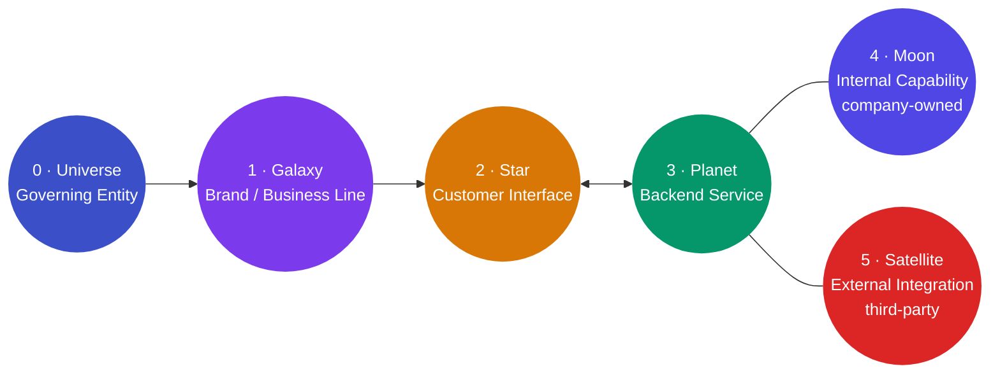
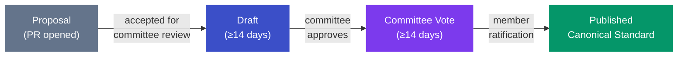

# LEBOSS

**Local Entrepreneur Business Operating System Standards**

[](STATUS.md)
[](STATUS.md)
[](LICENSE)
[](standards/leboss-standard.md)
[](standards/leboss-normative-rules.md)
[](https://leboss.status26.com/)

> **An open governance standard that puts local business data ownership back in the hands of the business.**

**LEBOSS is an open governance standard and a published presentation portal — not an app, SDK, or package you install.** It defines ownership, access control, delegation, enforcement, audit, portability, identity, and revocation for local business data systems. You read the spec, run the decks, or implement against it.

---

## The Problem

Local businesses run on software — CRM, scheduling, billing, marketing, point-of-sale. Each system holds a piece of the business's operational data. In most cases, the **platform controls the data, not the business**.

- Switching vendors means losing history.
- Integrations acquire access without declared scope.
- There is no audit trail the business can inspect.
- Portability is a feature the vendor offers, not a right the owner holds.

LEBOSS treats this as a **structural problem with a structural solution**: define ownership **architecturally, not contractually**. The owner of a business owns its data — and that ownership should be a property of the system's design, not a clause to be read in a contract after something has already gone wrong.

---

## The Reference Model

LEBOSS describes any local-business data system as six hierarchical elements. The **Universe** (Governing Entity) is the root owner of all data; every other element operates under explicit, scoped, revocable authorization, and every governed operation produces an Audit Record.



| Element | Role |
|---------|------|
| **0 · Universe** | Governing Entity — the person, family, or legal entity that owns all data |
| **1 · Galaxy** | A brand or business line owned by the Universe |
| **2 · Star** | Customer-facing interface (website, app, booking portal); cannot function without a Planet |
| **3 · Planet** | Backend service that powers a Star; holds primary operational data |
| **4 · Moon** | A *natural* satellite — a company-owned, company-operated internal capability |
| **5 · Satellite** | An *artificial* satellite — a third-party integration; the greatest sovereignty risk, so it must be explicitly authorized and audited |

Star and Planet depend on each other bidirectionally: without a Planet to support it a Star cannot function, and without a Star a Planet serves no one. Moons and Satellites are *associated with* the Planet layer — they are capabilities and connections, not children in the ownership tree.

<details>
<summary>Plain-text version of the reference model</summary>

```
LEBOSS Reference Model
───────────────────────────────────────────────────────

  ┌─────────────────┐
  │   0 · Universe  │   Root owner (person / family / legal entity)
  │ Governing Entity│
  └────────┬────────┘
           │ owns
  ┌────────▼────────┐
  │   1 · Galaxy    │   Brand or business line
  └────────┬────────┘
           │ contains
  ┌────────▼────────┐       ┌─────────────────────┐
  │   2 · Star      │◄─────►│   3 · Planet         │
  │ Customer        │       │ Backend Service      │
  │ Interface       │       │ (holds primary data) │
  └─────────────────┘       └──────────┬───────────┘
                                       │
                          ┌────────────┴────────────┐
                          │                         │
                 ┌────────▼────────┐       ┌────────▼────────┐
                 │   4 · Moon      │       │  5 · Satellite  │
                 │ Internal        │       │ External        │
                 │ Capability      │       │ Integration     │
                 │ [company-owned] │       │ [third-party]   │
                 └─────────────────┘       └─────────────────┘

  Moon:      natural satellite — company owned, company operated
  Satellite: artificial satellite — third-party, outside direct control
```

</details>

> See the interactive version in the Architecture deck at **[leboss.status26.com/architecture/](https://leboss.status26.com/architecture/)**.

---

## What You Get

- **115 normative rules across 19 rule groups** — each coded `LEBOSS-{GROUP}-{n}` and traceable to its source section in the standard.
- **A single ownership vocabulary** — the six-element reference model, defined once and referenced everywhere without drift.
- **Owner-first data sovereignty** made architecturally enforceable, not contractual: the Governing Entity owns all data; everything else operates under scoped, revocable authorization.
- **Audit as the system of record** — the audit corpus, not internal state, is the canonical truth.
- **Checkable conformance** — 25 named non-conformance conditions, each mapped to specific rule IDs, plus two clear tiers.
- **Open governance machinery** — proposal lifecycle, committee roles, conflict-of-interest policy, and PR template, all written.

---

## Getting Started

There is no package to install. Pick the path that fits your role.

### 1 · Read the standard

The authoritative artifact is Markdown. A good order:

1. **[charter/mission.md](charter/mission.md)** — why LEBOSS exists.
2. **[standards/leboss-standard.md](standards/leboss-standard.md)** — the base standard: scope, core concepts, the §5 reference model, ownership doctrine, service-provider obligations, conformance.
3. **[standards/leboss-normative-rules.md](standards/leboss-normative-rules.md)** — the flat 115-rule register; your implementer checklist.
4. **[standards/conformance.md](standards/conformance.md)** — the two conformance tiers and the 25 non-conformance conditions.
5. **[glossary/terms.md](glossary/terms.md)** — keep it open while you read.

New to the model? Start with [docs/explanation/why-the-orbital-model.md](docs/explanation/why-the-orbital-model.md), then walk through [docs/tutorials/model-your-first-business.md](docs/tutorials/model-your-first-business.md).

### 2 · Run the presentation decks locally

The three decks (Overview, Architecture, Governance) are deployed live at [leboss.status26.com](https://leboss.status26.com/). To run them yourself you need **Node.js 22** (pinned in `.nvmrc` and `package.json`):

```bash
cd presentations/slidev
npm install
npm run dev               # Overview deck
npm run dev:architecture  # Architecture deck
npm run dev:governance    # Governance deck
```

Each deck opens on its own port (Slidev prints the URL). To build all three exactly as deployed:

```bash
npm run build:all         # builds all three decks + copies _redirects into dist/
```

### 3 · Implement against the spec

LEBOSS defines governance, not implementation. **Database, language, API style, runtime, and infrastructure are all your choice** — any stack works as long as the governance rules hold. Then declare one of two conformance tiers:

- **LEBOSS-aligned** — your system preserves the six-element hierarchy, ownership boundaries, and dependency/access relationships from the reference model.
- **LEBOSS-compliant** — your system satisfies *every* MUST-level requirement in [standards/conformance.md](standards/conformance.md), with none of the 25 non-conformance conditions true of it.

Conformance is **self-declared**; there is no third-party certification program in this version. See [docs/how-to/check-conformance.md](docs/how-to/check-conformance.md) and [docs/how-to/map-a-satellite-conformantly.md](docs/how-to/map-a-satellite-conformantly.md), and the exact normative breakdown in [docs/reference/normative-structure.md](docs/reference/normative-structure.md). When you ship something, register it by PR to [IMPLEMENTATIONS.md](IMPLEMENTATIONS.md) (currently empty — you would be the first).

---

## Why This — and When You Don't Need It

LEBOSS makes data ownership **architectural and conformance-checkable** — not contractual, not jurisdictional, not ad-hoc. It gives a local business owner one model of the entire data footprint, three governance objects the *owner* holds (Access Grant, Integration Descriptor, Audit Record), and 115 traceable rules with 25 named non-conformance conditions. None of the common alternatives do all of that:

- **Vendor terms of service** work today, but they govern what the *vendor* will do — not what you own architecturally. Portability is a feature that can be deprecated.
- **Ad-hoc per-vendor data agreements** can be highly protective, but they don't scale across a multi-vendor stack and aren't checkable.
- **Data-protection law (GDPR, CCPA)** has real legal force — but it governs the business-to-regulator relationship and your customers' rights, not how your own systems should be structured. LEBOSS is complementary, not a substitute.
- **Data-portability efforts** are great for a concrete migration, but they answer "can I get my data out of X?" rather than "what governs ownership across my whole stack?"

**You probably don't need LEBOSS if** you run a single isolated system with no integrations; your concern is regulatory compliance (talk to counsel and follow the law); you have a one-time migration to do (you need an export, not an architecture); you have no continuity or ownership-transfer concern; or you need something to run **today** — LEBOSS is a release candidate with zero implementations.

For the full positioning, see [docs/explanation/why-the-orbital-model.md](docs/explanation/why-the-orbital-model.md) and [docs/PHILOSOPHY.md](docs/PHILOSOPHY.md).

---

## Governance Lifecycle

Every change to the standard moves through four stages. The version number encodes the stage: Draft increments the rightmost digit (Z), Committee Vote increments the middle (Y), and Published increments the leftmost (X).



LEBOSS is currently at **v0.1.0-rc** (proposal 0.0.29) — a structurally complete release candidate for the **first** Committee Vote. The next milestone, **v0.1.0**, opens that vote.

---

## Trust & Maturity

This is an open-standards project early in its life. Both sides of that are stated plainly.

**Real and verifiable:**

- **CC BY 4.0 license** present at the repo root.
- **A live, deployed portal** on Netlify, with a deploy preview generated for every PR and a committed lockfile for reproducible builds.
- **A 29-proposal change history** (`0.0.1 → 0.0.29`), each directory preserved as a permanent record.
- **115 traceable normative rules** and 25 non-conformance conditions, with version numbers consistent across every document.
- **A fully written governance process** — proposal lifecycle, committee roles, PR template, conflict-of-interest policy.

**Honest gaps (do not read past these):**

- **No implementations yet** — `IMPLEMENTATIONS.md` is empty.
- **Committee not appointed** — the Maintainer is "to be appointed" and member seats are open for nomination, so the first Committee Vote cannot be called yet.
- **v0.1.0 has not been voted or ratified** — and conformance is self-declared; there is no certification body or third-party audit program.
- **No CI / no automated build verification** — there is no `.github/` directory; build correctness is only checked when Netlify deploys.
- **Git tags stop at `v0.0.11`** — `v0.0.12`–`v0.0.29` are untagged, so intermediate proposals cannot be pinned by tag.
- **Slidev is pinned to an older release** (`@slidev/cli` 0.49.29) with no dependency scanning.

The responsible expectation: **safe to read, safe to design against, not yet a frozen reference.** Rules may change at any proposal cycle before the first Published standard (v1.0.0); annotate anything you reference as "per LEBOSS v0.1.0-rc — subject to change."

---

## Repository Map

| Path | Purpose |
|------|---------|
| [`standards/`](standards/) | Normative specification — all MUST / MUST NOT / MAY requirements |
| [`glossary/`](glossary/) | Canonical terminology |
| [`governance/`](governance/) | Governance model — proposal lifecycle, committee roles |
| [`proposals/`](proposals/) | Specification change history (0.0.1 → 0.0.29) |
| [`presentations/`](presentations/) | Three-deck Slidev portal (deployed to leboss.status26.com) |
| [`charter/`](charter/) | Mission and philosophical foundation |
| [`docs/`](docs/) | Tutorials, how-to guides, reference, and explanation |

**Key links:**

| | |
|--|--|
| **The standard** | [standards/leboss-standard.md](standards/leboss-standard.md) |
| **Rule register** | [standards/leboss-normative-rules.md](standards/leboss-normative-rules.md) |
| **Conformance** | [standards/conformance.md](standards/conformance.md) |
| **Normative structure** | [docs/reference/normative-structure.md](docs/reference/normative-structure.md) |
| **Glossary** | [glossary/terms.md](glossary/terms.md) |
| **Philosophy** | [docs/PHILOSOPHY.md](docs/PHILOSOPHY.md) |
| **Tutorials & guides** | [docs/](docs/) |
| **Governance** | [governance/governance.md](governance/governance.md) |
| **Changelog** | [CHANGELOG.md](CHANGELOG.md) |
| **Contributing** | [CONTRIBUTING.md](CONTRIBUTING.md) |
| **License** | [LICENSE](LICENSE) |
| **Status** | [STATUS.md](STATUS.md) |
| **Live portal** | [leboss.status26.com](https://leboss.status26.com/) |

---

## Contributing

LEBOSS is at a formative moment — the standard is structurally complete, but the committee is forming and no implementations are registered yet, so early contributions carry real weight. There are four ways in:

1. **Open a proposal** — a PR against `master` that introduces or modifies content in `standards/`. Anyone may open one; this is how the standard reached 0.0.29. Branch `proposal/X.Y.Z` (e.g. `0.0.30`), add `proposals/X.Y.Z/proposal.md`, edit the spec, and open the PR.
2. **Challenge a rule** — open an issue that names a gap, ambiguity, or contradiction. You don't need a fix to contribute substantively.
3. **Improve the decks** — PRs to `presentations/slidev/` follow the same conventions and must keep `npm run build:all` passing.
4. **Register an implementation** — when you build a LEBOSS-aligned or LEBOSS-compliant system, file a PR to `IMPLEMENTATIONS.md`.

Proposals use a five-section PR template (Summary, Motivation, Specification Changes, Impact Assessment, Backward Compatibility) and may be returned if it's missing. All commits follow [Conventional Commits](https://www.conventionalcommits.org/). The committee is open for nomination — open an issue titled `Committee Nomination: [Your Name]` with your background and any conflicts of interest.

Full process: [CONTRIBUTING.md](CONTRIBUTING.md).

---

## License

LEBOSS is licensed under the **Creative Commons Attribution 4.0 International (CC BY 4.0)** license — see [LICENSE](LICENSE). You may reproduce, distribute, and build on this specification, including for conforming implementations, with attribution. All content in this repository is available for adoption, implementation, critique, and contribution.
