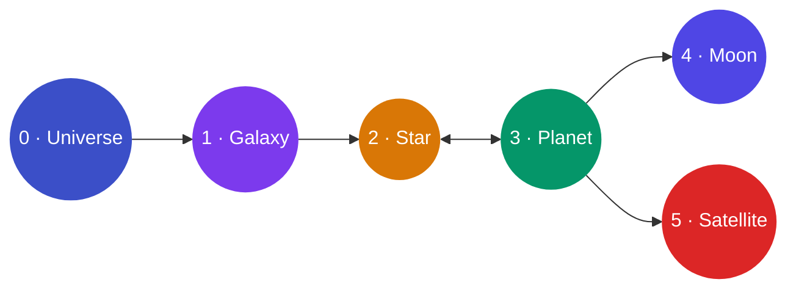

# LEBOSS

**Local Entrepreneur Business Operating System Standards**

**Updated Through:** proposal/0.0.29

> An open governance standard defining ownership, access control, delegation, enforcement, audit, portability, identity, and revocation requirements for local business data systems.

See [STATUS.md](STATUS.md) for current specification status and release information.

---

## The Problem

Local businesses run on software. CRM, scheduling, billing, marketing, point-of-sale. Each system holds a piece of the business's operational data. In most cases, the **platform controls the data** — not the business.

- Switching vendors means losing history
- Integrations acquire access without declared scope
- No audit trail the business can inspect
- Portability is a feature, not a right

LEBOSS treats this as a **structural problem** with a structural solution: define ownership architecturally, not contractually.

---

## What LEBOSS Does

LEBOSS defines:

- **A reference model** — six hierarchical elements that describe who owns what in a local business software system
- **Governance objects** — the primitives (Access Grants, Audit Records, Integration Descriptors, Resources) that make data ownership enforceable
- **Operational protocols** — normative rules for how those objects behave across their lifecycle
- **A conformance definition** — the minimum requirements for claiming LEBOSS compatibility

| Element | Role |
|---------|------|
| **0 · Universe** | Governing Entity — root owner of all data |
| **1 · Galaxy** | Brand or business line |
| **2 · Star** | Customer-facing interface |
| **3 · Planet** | Backend service — holds primary operational data |
| **4 · Moon** | Company-owned internal capability |
| **5 · Satellite** | Third-party integration |

The **Governing Entity** (Universe) owns all data. Every other element operates under explicit, scoped, revocable authorization. All governed operations produce Audit Records. The complete environment is always exportable by the Governing Entity.

---

## Five Foundation Principles

| # | Principle | Meaning |
|---|-----------|---------|
| 1 | **Clarity** | Every element has a defined role and ownership boundary |
| 2 | **Modularity** | Capabilities are interchangeable — replacing one does not cascade |
| 3 | **Security** | Entity-separated data, least-privilege access, auditable operations |
| 4 | **Legacy & Continuity** | Systems survive ownership transitions and vendor changes |
| 5 | **Extensibility** | New capabilities attach without disrupting existing structure |

---

## Specification

| Document | Content |
|----------|---------|
| [standards/leboss-standard.md](standards/leboss-standard.md) | Base standard — reference model, data ownership doctrine, service provider obligations, conformance |
| [standards/conformance.md](standards/conformance.md) | Conformance definition — minimum requirements for LEBOSS-compliant implementations |
| [standards/leboss-normative-rules.md](standards/leboss-normative-rules.md) | Flat rule register — 115 normative rules across 19 rule groups |
| [standards/leboss-resource-model.md](standards/leboss-resource-model.md) | Resource Model |
| [standards/leboss-access-grant-protocol.md](standards/leboss-access-grant-protocol.md) | Access Grant Protocol |
| [standards/leboss-integration-protocol.md](standards/leboss-integration-protocol.md) | Integration Descriptor Protocol |
| [standards/leboss-audit-protocol.md](standards/leboss-audit-protocol.md) | Audit Record Collection Protocol |
| [standards/leboss-data-portability-protocol.md](standards/leboss-data-portability-protocol.md) | Data Portability Protocol |
| [standards/objects/access-grant.md](standards/objects/access-grant.md) | Access Grant object definition |
| [standards/objects/integration-descriptor.md](standards/objects/integration-descriptor.md) | Integration Descriptor object definition |
| [standards/objects/audit-record.md](standards/objects/audit-record.md) | Audit Record object definition |

---

## Repository Structure

| Directory | Purpose |
|-----------|---------|
| [`standards/`](standards/) | Normative specification — all MUST/SHOULD/MAY requirements |
| [`glossary/`](glossary/) | Canonical terminology definitions |
| [`governance/`](governance/) | Governance model — proposal lifecycle, committee roles |
| [`proposals/`](proposals/) | Specification change history (0.0.1 → 0.0.29) |
| [`presentations/`](presentations/) | Three-deck Slidev presentation portal |
| [`charter/`](charter/) | Mission and philosophical foundation |

---

## Quick Links

| | |
|--|--|
| **Specification** | [standards/leboss-standard.md](standards/leboss-standard.md) |
| **Conformance** | [standards/conformance.md](standards/conformance.md) |
| **Glossary** | [glossary/terms.md](glossary/terms.md) |
| **Governance** | [governance/governance.md](governance/governance.md) |
| **Proposals** | [proposals/](proposals/) |
| **Status** | [STATUS.md](STATUS.md) |
| **Presentations** | [leboss.status26.com](https://leboss.status26.com/) |
| **Implementations** | [IMPLEMENTATIONS.md](IMPLEMENTATIONS.md) |

---

## Presentations

The specification is published as a three-deck interactive presentation portal at **[leboss.status26.com](https://leboss.status26.com/)**.

| Deck | Audience | URL |
|------|----------|-----|
| Overview | Business owners, evaluators | [leboss.status26.com](https://leboss.status26.com/) |
| Architecture | Developers, architects | [leboss.status26.com/architecture/](https://leboss.status26.com/architecture/) |
| Governance | Contributors, implementers | [leboss.status26.com/governance/](https://leboss.status26.com/governance/) |

---

## Ecosystem

See [IMPLEMENTATIONS.md](IMPLEMENTATIONS.md) for projects implementing the LEBOSS standard.

---

## Contributing

LEBOSS is an open standard. Contributions are welcome from developers, architects, business owners, and anyone with a stake in local business data sovereignty.

**Specification changes** require a proposal in [`proposals/`](proposals/).
**Editorial improvements** to documentation may be submitted directly as a pull request.

See [CONTRIBUTING.md](CONTRIBUTING.md) for the full process — how to open a proposal, the lifecycle from Proposal → Draft → Committee Vote → Published, and how to nominate yourself for the committee.

Every pull request automatically generates a **Netlify preview** of the presentation system so reviewers can see changes live before merging.

---

## Current Status

The specification is at the **pre-v0.1.0 draft** milestone — structurally complete and open for community contribution. The standard covers the full governance layer across 115 normative rules and 19 rule groups. All boundary gaps identified in the 0.0.21 stress test have been resolved.

**Foundation (0.0.1–0.0.12):** Initial doctrine, normative rule register, governance object model, five operational protocols, resource model, conformance requirements, and terminology stabilization.

**Governance boundary and enforcement (0.0.13–0.0.20):** Specification and implementation boundary defined; enforcement responsibility, audit as system of record, portability format requirements, resource identity mapping, delegation constraints, conformance verification, and structural normalization.

**Stress test and gap closure (0.0.21–0.0.29):** Boundary stress test identified enforcement gaps; primary operational data boundary (OWN-9–10), service provider boundary (SVC-8–9), protocol normativity alignment (PROT-1–5), actor identity portability (ACTOR-1–6), governing entity authenticity (GEA-1–6), audit resolution requirements (AUD-1–6), delegation chain lifetime integrity (DCL-1–6), and revocation enforcement timing (REV-1–6).

Full proposal history is in [`proposals/`](proposals/) and in [STATUS.md](STATUS.md).

The next milestone is **v0.1.0** — the first Committee Vote candidate.

---

*LEBOSS is an open standard. All content in this repository is available for adoption, implementation, critique, and contribution.*
